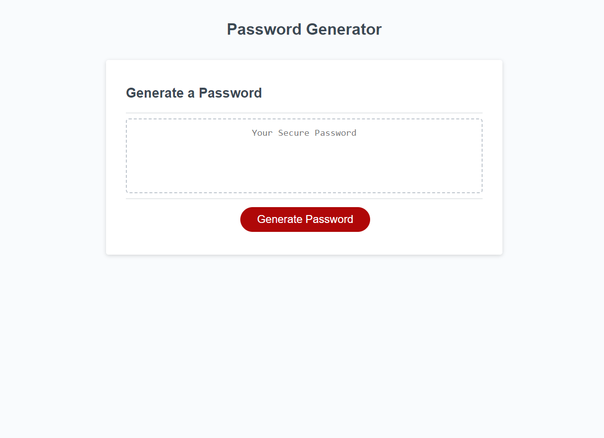

# <Maguire Wilson's password Generator'>

## Description

A simple webpage to generate random passwords

## Table of Contents

- [Installation](#installation)
- [Usage](#usage)
- [Credits](#credits)
- [Features](#features)
- [screenshot](#screenshot)

## Installation

Using any web browser, open the provided URL and press the big red button.

## Usage

Generate random passwors with your choice of capitals, lowercase, symbols, and/or numbers.

## Credits

Maguire Wilson. Thanks to Borislav Hadzheiv for example on random string generator. (https://bobbyhadz.com/blog/javascript-get-multiple-random-elements-from-array)
Thanks to Xandromus for starter code. https://github.com/coding-boot-camp/friendly-parakeet

## Features

Functional links [LINK TO ONLINE SITE] (https://macrowil.github.io/Maguire-Wilson-Password-Generator/)

## Screenshot

